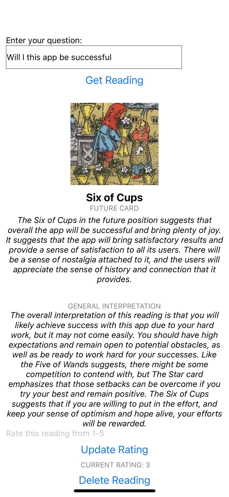

## This app is a Tarot Card reading app that delivers the user a three card reading leveraging the power of the OpenAI API. 

## Tech Stack
* React Native
* NodeJS
* Mongo DB
* OpenAI
* Canva

## Model:
### Single Model ERD
*  question: {type: String, required: true},
*  rating: {type: Number, required: false},
*  past_card: {type: String, required: true},
*  past_card_interpretation: {type: String, required: true},
*  present_card: {type: String, required: true},
*  present_card_interpretation: {type: String, required: true},
*  future_card: {type: String, required: true},
*  future_card_interpretation: {type: String, required: true},
*  general_interpretation: {type: String, required: true},
*  timestamps: true

## Roadmap
* More models and Reading Types
* User Authentication
* User Model Tied to Reading Model
* User Profile for add feature benefit
** Horoscopes
** Numerology
** Paywall
** Load your own deck backing
  
## Wireframe:

## Live link on Expo Go!

exp://exp.host/@theonlykmac/TarotAi?release-channel=default

## ScreenShots

